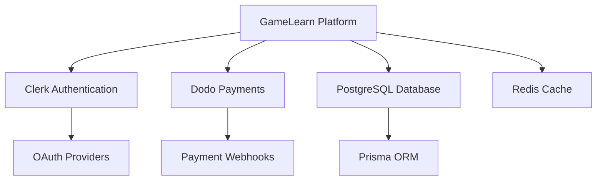

# Production Integration Verification Guide

This document provides comprehensive checklists and procedures for verifying all integrations before production launch of the LazyGameDevs GameLearn Platform.

## Table of Contents

1. [Overview](#overview)
2. [Pre-Launch Verification Matrix](#pre-launch-verification-matrix)
3. [Clerk Authentication Verification](#clerk-authentication-verification)
4. [Dodo Payments Verification](#dodo-payments-verification)
5. [Integration Testing Procedures](#integration-testing-procedures)
6. [Performance Testing](#performance-testing)
7. [Security Verification](#security-verification)
8. [Rollback Procedures](#rollback-procedures)
9. [Launch Day Checklist](#launch-day-checklist)

## Overview

### Purpose

This guide ensures all critical integrations are properly configured, tested, and monitored before production launch. Following these procedures minimizes risk and ensures a smooth user experience.

### Integration Dependencies



### Verification Phases

1. **Phase 1**: Environment Configuration (30 minutes)
2. **Phase 2**: Service Integration Testing (2 hours)
3. **Phase 3**: End-to-End Testing (3 hours)
4. **Phase 4**: Load Testing (1 hour)
5. **Phase 5**: Security Audit (1 hour)
6. **Phase 6**: Monitoring Setup (30 minutes)

**Total Estimated Time**: 8 hours

## Pre-Launch Verification Matrix

### Critical Systems Status

| System | Status | Priority | Dependencies | Verified By | Date |
|--------|--------|----------|--------------|-------------|------|
| Clerk Authentication | ⏳ Pending | P0 | Domain, SSL | | |
| Dodo Payments | ⏳ Pending | P0 | API Keys, Webhooks | | |
| Database (PostgreSQL) | ⏳ Pending | P0 | Connection String | | |
| Redis Cache | ⏳ Pending | P1 | Connection String | | |
| OAuth - Google | ⏳ Pending | P0 | Clerk Integration | | |
| OAuth - GitHub | ⏳ Pending | P0 | Clerk Integration | | |
| Video Streaming | ⏳ Pending | P1 | Storage, CDN | | |
| Email Service | ⏳ Pending | P2 | SMTP/SendGrid | | |

**Priority Levels**:
- **P0**: Critical - Must work for launch
- **P1**: High - Should work for launch
- **P2**: Medium - Can be fixed post-launch

### Environment Validation

#### 1. Required Environment Variables

```bash
#!/bin/bash
# Environment Validation Script

echo "🔍 Validating Production Environment Variables..."

required_vars=(
  "DATABASE_URL"
  "NEXT_PUBLIC_CLERK_PUBLISHABLE_KEY"
  "CLERK_SECRET_KEY"
  "CLERK_WEBHOOK_SECRET"
  "DODO_API_KEY"
  "DODO_WEBHOOK_SECRET"
  "DODO_ENVIRONMENT"
  "APP_URL"
  "API_BASE_URL"
)

missing_vars=()

for var in "${required_vars[@]}"; do
  if [ -z "${!var}" ]; then
    missing_vars+=("$var")
    echo "❌ Missing: $var"
  else
    echo "✅ Found: $var"
  fi
done

if [ ${#missing_vars[@]} -eq 0 ]; then
  echo "✅ All required environment variables are set"
  exit 0
else
  echo "❌ Missing ${#missing_vars[@]} required variables"
  exit 1
fi
```

#### 2. Configuration Validation

```typescript
// Run this script to validate configuration
// File: scripts/validate-config.ts

import { paymentConfig } from '@/lib/config/env'
import { dodoPayments } from '@/lib/payments/dodo'

async function validateConfiguration() {
  console.log('🔍 Validating Production Configuration...\n')

  const checks = [
    {
      name: 'Database Connection',
      fn: async () => {
        const { PrismaClient } = await import('@prisma/client')
        const prisma = new PrismaClient()
        await prisma.$connect()
        await prisma.$disconnect()
      }
    },
    {
      name: 'Clerk Configuration',
      fn: async () => {
        if (!process.env.NEXT_PUBLIC_CLERK_PUBLISHABLE_KEY?.startsWith('pk_live_')) {
          throw new Error('Not using production Clerk keys')
        }
        if (!process.env.CLERK_SECRET_KEY?.startsWith('sk_live_')) {
          throw new Error('Not using production Clerk keys')
        }
      }
    },
    {
      name: 'Dodo Payments Configuration',
      fn: async () => {
        if (!paymentConfig.dodo.apiKey?.startsWith('live_sk_')) {
          throw new Error('Not using production Dodo keys')
        }
        if (paymentConfig.dodo.environment !== 'live') {
          throw new Error('Dodo environment not set to live')
        }
      }
    },
    {
      name: 'SSL Certificate',
      fn: async () => {
        const appUrl = process.env.APP_URL
        if (!appUrl?.startsWith('https://')) {
          throw new Error('APP_URL must use HTTPS in production')
        }
      }
    }
  ]

  let passed = 0
  let failed = 0

  for (const check of checks) {
    try {
      await check.fn()
      console.log(`✅ ${check.name}`)
      passed++
    } catch (error) {
      console.error(`❌ ${check.name}: ${error.message}`)
      failed++
    }
  }

  console.log(`\n📊 Results: ${passed} passed, ${failed} failed`)

  if (failed > 0) {
    process.exit(1)
  }
}

validateConfiguration()
```

## Clerk Authentication Verification

### Phase 1: Basic Configuration

#### 1.1 Domain Verification

```bash
# Verify DNS configuration
dig accounts.lazygamedevs.com

# Expected output should show CNAME to Clerk
# accounts.lazygamedevs.com. 300 IN CNAME accounts.clerk.com.

# Verify SSL certificate
openssl s_client -connect accounts.lazygamedevs.com:443 -servername accounts.lazygamedevs.com < /dev/null

# Check certificate validity
curl -I https://accounts.lazygamedevs.com
```

**Checklist**:
- [ ] DNS records configured
- [ ] DNS propagation complete (< 48 hours)
- [ ] SSL certificate issued
- [ ] Certificate valid and trusted
- [ ] Domain accessible via HTTPS

#### 1.2 API Keys Verification

```typescript
// Test Clerk API connectivity
import { clerkClient } from '@clerk/nextjs/server'

async function testClerkAPI() {
  try {
    // Test API access
    const users = await clerkClient.users.getUserList({ limit: 1 })
    console.log('✅ Clerk API accessible')
    return true
  } catch (error) {
    console.error('❌ Clerk API error:', error.message)
    return false
  }
}
```

**Checklist**:
- [ ] Production publishable key (pk_live_) configured
- [ ] Production secret key (sk_live_) configured
- [ ] Keys accessible from application
- [ ] API connectivity successful
- [ ] No test keys in production environment

### Phase 2: OAuth Provider Testing

#### 2.1 Google OAuth

```typescript
// Test Google OAuth flow
async function testGoogleOAuth() {
  const testUrl = `${process.env.APP_URL}/sign-in`

  console.log('🔍 Testing Google OAuth...')
  console.log('1. Navigate to:', testUrl)
  console.log('2. Click "Continue with Google"')
  console.log('3. Complete Google authentication')
  console.log('4. Verify redirect to dashboard')

  // Manual verification checklist
  return {
    initiationWorks: false, // Set manually
    redirectWorks: false,   // Set manually
    userCreated: false,     // Set manually
    sessionEstablished: false // Set manually
  }
}
```

**Test Procedure**:
1. Open browser in incognito mode
2. Navigate to sign-in page
3. Click "Continue with Google"
4. Complete Google authentication
5. Verify redirect to dashboard
6. Check user creation in database
7. Verify session establishment

**Checklist**:
- [ ] OAuth consent screen configured
- [ ] App published to production
- [ ] Redirect URIs configured correctly
- [ ] Google credentials in Clerk
- [ ] Sign-in flow works end-to-end
- [ ] User profile synced correctly
- [ ] Session persists across pages

#### 2.2 GitHub OAuth

Follow similar procedure as Google OAuth.

**Checklist**:
- [ ] GitHub OAuth app created
- [ ] Callback URL configured
- [ ] GitHub credentials in Clerk
- [ ] Sign-in flow works end-to-end
- [ ] User profile synced correctly

### Phase 3: Webhook Verification

```bash
# Test Clerk webhook endpoint
curl -X GET https://lazygamedevs.com/api/webhooks/clerk

# Expected response:
# {"message":"Clerk webhook endpoint is active","timestamp":"..."}
```

```typescript
// Test webhook signature verification
import { Webhook } from 'svix'

async function testClerkWebhook() {
  const webhookSecret = process.env.CLERK_WEBHOOK_SECRET

  // Send test event from Clerk Dashboard
  console.log('Send test webhook event from Clerk Dashboard')
  console.log('Webhook endpoint: /api/webhooks/clerk')

  // Verify webhook processing
  // Check logs for successful processing
}
```

**Checklist**:
- [ ] Webhook endpoint accessible
- [ ] Webhook secret configured
- [ ] Test event sent from Clerk Dashboard
- [ ] Signature verification working
- [ ] Event processing successful
- [ ] User creation webhook works
- [ ] User update webhook works

### Phase 4: Session Management

```typescript
// Test session management
async function testSessionManagement() {
  const tests = [
    {
      name: 'Session Creation',
      test: async () => {
        // Sign in user
        // Verify session created
      }
    },
    {
      name: 'Session Persistence',
      test: async () => {
        // Reload page
        // Verify session persists
      }
    },
    {
      name: 'Session Expiration',
      test: async () => {
        // Wait for session timeout
        // Verify session expired
      }
    }
  ]

  for (const test of tests) {
    console.log(`Testing: ${test.name}`)
    await test.test()
  }
}
```

**Checklist**:
- [ ] Session created on sign-in
- [ ] Session persists across pages
- [ ] Session expires correctly
- [ ] Sign-out works properly
- [ ] Protected routes secured
- [ ] Public routes accessible

## Dodo Payments Verification

### Phase 1: API Connectivity

#### 1.1 API Key Validation

```typescript
// Test Dodo API connectivity
import { dodoPayments } from '@/lib/payments/dodo'

async function testDodoAPI() {
  try {
    // Test products endpoint
    const products = await dodoPayments.listProducts()
    console.log('✅ Dodo API accessible')
    console.log(`Found ${products.length} products`)
    return true
  } catch (error) {
    console.error('❌ Dodo API error:', error.message)
    return false
  }
}
```

**Checklist**:
- [ ] Production API key (live_sk_) configured
- [ ] Environment set to "live"
- [ ] API connectivity successful
- [ ] Products list retrieves correctly
- [ ] Error handling works

#### 1.2 Product Configuration

```typescript
// Verify product configuration
async function verifyProducts() {
  const products = await dodoPayments.listProducts()

  for (const product of products) {
    console.log(`\nProduct: ${product.name}`)
    console.log(`- Price: ${product.price} ${product.currency}`)
    console.log(`- Tax Category: ${product.taxCategory}`)
    console.log(`- License Keys: ${product.licenseKeyEnabled ? 'Enabled' : 'Disabled'}`)

    // Verify against expected configuration
    if (!product.licenseKeyEnabled) {
      console.warn(`⚠️  License keys not enabled for ${product.name}`)
    }
  }
}
```

**Checklist**:
- [ ] All courses configured as products
- [ ] Prices set correctly
- [ ] Currency configured (INR/USD)
- [ ] Tax categories assigned
- [ ] License keys enabled
- [ ] Product metadata complete

### Phase 2: Checkout Flow Testing

#### 2.1 Checkout Session Creation

```typescript
// Test checkout session creation
async function testCheckoutSession() {
  try {
    const session = await dodoPayments.createCheckoutSession({
      products: [
        {
          productId: 'prod_test_id', // Replace with real product ID
          quantity: 1
        }
      ],
      customer: {
        name: 'Test Customer',
        email: 'test@lazygamedevs.com'
      },
      returnUrl: `${process.env.APP_URL}/payment/success`,
      metadata: {
        courseId: 'course_test',
        userId: 'user_test'
      }
    })

    console.log('✅ Checkout session created')
    console.log(`Session ID: ${session.id}`)
    console.log(`Checkout URL: ${session.url}`)

    return session
  } catch (error) {
    console.error('❌ Checkout session error:', error.message)
    throw error
  }
}
```

**Checklist**:
- [ ] Checkout session creates successfully
- [ ] Session URL generated
- [ ] Return URL configured correctly
- [ ] Metadata included properly
- [ ] Customer info captured

#### 2.2 End-to-End Payment Test

**Test Procedure**:
1. Create test user account
2. Browse to course page
3. Click "Purchase Course"
4. Complete checkout session
5. Use test payment method
6. Complete payment
7. Verify redirect to success page
8. Check webhook received
9. Verify license key generated
10. Confirm course access granted

**Checklist**:
- [ ] Purchase button works
- [ ] Checkout page loads
- [ ] Payment methods display
- [ ] Test payment succeeds
- [ ] Redirect to success page
- [ ] Success page displays correctly
- [ ] Database records created

### Phase 3: Webhook Integration

#### 3.1 Webhook Endpoint Testing

```bash
# Test webhook endpoint accessibility
curl -X GET https://lazygamedevs.com/api/webhooks/dodo

# Expected response:
# {"message":"Dodo Payments webhook endpoint is active","timestamp":"..."}

# Test webhook with test signature
curl -X POST https://lazygamedevs.com/api/webhooks/dodo \
  -H "Content-Type: application/json" \
  -H "x-dodo-signature: test_signature" \
  -d '{"type":"payment.succeeded","data":{}}'
```

**Checklist**:
- [ ] Webhook endpoint accessible
- [ ] GET request returns active status
- [ ] POST request accepted
- [ ] Signature verification working

#### 3.2 Webhook Event Handling

```typescript
// Test webhook event processing
async function testWebhookProcessing() {
  const events = [
    'payment.succeeded',
    'payment.failed',
    'license_key.created'
  ]

  console.log('Send test events from Dodo Dashboard:')
  for (const event of events) {
    console.log(`- ${event}`)
  }

  console.log('\nVerify in application logs:')
  console.log('- Event received')
  console.log('- Signature verified')
  console.log('- Event processed')
  console.log('- Database updated')
}
```

**Checklist**:
- [ ] payment.succeeded event handled
- [ ] payment.failed event handled
- [ ] license_key.created event handled
- [ ] Database updated correctly
- [ ] Course access granted
- [ ] Error notifications sent

### Phase 4: License Key System

```typescript
// Test license key generation and validation
async function testLicenseKeys() {
  // Simulate payment success
  const paymentId = 'test_payment_123'
  const courseId = 'course_123'
  const userId = 'user_123'

  // Check license key created
  const licenseKey = await prisma.licenseKey.findFirst({
    where: {
      payment: { dodoPaymentId: paymentId }
    }
  })

  console.log('License Key:', licenseKey?.key)

  // Test activation
  if (licenseKey) {
    const activated = await activateLicenseKey(licenseKey.key, userId)
    console.log('Activation:', activated ? 'Success' : 'Failed')
  }

  // Test course access
  const hasAccess = await checkCourseAccess(userId, courseId)
  console.log('Course Access:', hasAccess ? 'Granted' : 'Denied')
}
```

**Checklist**:
- [ ] License key generates on payment
- [ ] Key format correct
- [ ] Key activation works
- [ ] Course access granted
- [ ] Key validation prevents reuse
- [ ] Expiration handling works (if applicable)

## Integration Testing Procedures

### End-to-End User Flows

#### Flow 1: New User Registration and Purchase

```typescript
// Automated test for complete user journey
describe('Complete User Journey', () => {
  it('should allow new user to register and purchase course', async () => {
    // Step 1: User registration via Google OAuth
    await page.goto(`${process.env.APP_URL}/sign-up`)
    await page.click('button:has-text("Continue with Google")')
    // Complete OAuth flow
    await expect(page).toHaveURL(/dashboard/)

    // Step 2: Browse courses
    await page.goto(`${process.env.APP_URL}/courses`)
    await expect(page.locator('.course-card')).toBeVisible()

    // Step 3: Select course
    await page.click('.course-card:first-child')
    await expect(page).toHaveURL(/course/)

    // Step 4: Purchase course
    await page.click('button:has-text("Purchase Course")')
    await expect(page).toHaveURL(/checkout/)

    // Step 5: Complete payment (test mode)
    await page.fill('input[name="card_number"]', '4111111111111111')
    await page.fill('input[name="expiry"]', '12/25')
    await page.fill('input[name="cvv"]', '123')
    await page.click('button:has-text("Pay Now")')

    // Step 6: Verify success
    await expect(page).toHaveURL(/success/, { timeout: 30000 })
    await expect(page.locator('text=Payment Successful')).toBeVisible()

    // Step 7: Verify course access
    await page.goto(`${process.env.APP_URL}/my-courses`)
    await expect(page.locator('text=Game Development Fundamentals')).toBeVisible()
  })
})
```

#### Flow 2: Returning User Purchase

**Manual Test Steps**:
1. Sign in with existing account
2. Browse to course page
3. Click purchase
4. Complete payment
5. Verify instant access
6. Check email confirmation
7. Verify license key in account

**Checklist**:
- [ ] Sign-in works
- [ ] Course displays correctly
- [ ] Purchase flow seamless
- [ ] Payment processes quickly
- [ ] Access granted immediately
- [ ] Email sent correctly
- [ ] License key visible

#### Flow 3: Failed Payment Handling

**Test Steps**:
1. Initiate course purchase
2. Use invalid payment method
3. Payment fails
4. Verify error message
5. Retry with valid payment
6. Complete successfully

**Checklist**:
- [ ] Error message clear
- [ ] No charge attempted
- [ ] No course access granted
- [ ] User can retry
- [ ] Retry succeeds
- [ ] Final state correct

## Performance Testing

### Load Testing

```bash
# Install k6 for load testing
brew install k6  # macOS
# or
apt-get install k6  # Linux

# Run load test
k6 run scripts/load-test.js
```

```javascript
// scripts/load-test.js
import http from 'k6/http'
import { check, sleep } from 'k6'

export let options = {
  stages: [
    { duration: '2m', target: 100 },  // Ramp up to 100 users
    { duration: '5m', target: 100 },  // Stay at 100 users
    { duration: '2m', target: 0 },    // Ramp down
  ],
  thresholds: {
    http_req_duration: ['p(95)<500'],  // 95% of requests under 500ms
    http_req_failed: ['rate<0.01'],    // Less than 1% failure rate
  },
}

export default function () {
  // Test homepage
  let res = http.get(`${__ENV.APP_URL}/`)
  check(res, { 'homepage loaded': (r) => r.status === 200 })

  sleep(1)

  // Test courses page
  res = http.get(`${__ENV.APP_URL}/courses`)
  check(res, { 'courses loaded': (r) => r.status === 200 })

  sleep(1)

  // Test API health
  res = http.get(`${__ENV.APP_URL}/api/health`)
  check(res, { 'API healthy': (r) => r.status === 200 })

  sleep(1)
}
```

**Performance Benchmarks**:
- Homepage load: < 2 seconds
- API response: < 500ms (p95)
- Database queries: < 100ms (p95)
- Payment processing: < 5 seconds
- Webhook processing: < 2 seconds

**Checklist**:
- [ ] Homepage performs well under load
- [ ] API endpoints responsive
- [ ] Database queries optimized
- [ ] No memory leaks
- [ ] Error rate acceptable
- [ ] Recovery from failures

## Security Verification

### Security Audit Checklist

#### 1. Authentication Security

```bash
# Test authentication security
# 1. Attempt to access protected routes without auth
curl https://lazygamedevs.com/dashboard
# Expected: Redirect to sign-in

# 2. Test CSRF protection
curl -X POST https://lazygamedevs.com/api/protected \
  -H "Content-Type: application/json" \
  -d '{"test":"data"}'
# Expected: 403 Forbidden

# 3. Test rate limiting
for i in {1..20}; do
  curl https://lazygamedevs.com/api/auth/signin
done
# Expected: 429 Too Many Requests after threshold
```

**Checklist**:
- [ ] Protected routes secured
- [ ] CSRF protection enabled
- [ ] Rate limiting active
- [ ] Session management secure
- [ ] Logout works correctly
- [ ] Token validation working

#### 2. Payment Security

```typescript
// Test payment security measures
async function testPaymentSecurity() {
  // Test 1: Webhook signature verification
  const invalidSignature = await testWebhookWithInvalidSignature()
  console.assert(!invalidSignature, 'Invalid signature should be rejected')

  // Test 2: Amount validation
  const invalidAmount = await testInvalidPaymentAmount()
  console.assert(!invalidAmount, 'Invalid amount should be rejected')

  // Test 3: Idempotency
  const duplicate = await testDuplicatePayment()
  console.assert(!duplicate, 'Duplicate payment should be prevented')

  console.log('✅ Payment security tests passed')
}
```

**Checklist**:
- [ ] Webhook signatures verified
- [ ] Payment amounts validated
- [ ] Duplicate payments prevented
- [ ] Sensitive data encrypted
- [ ] Audit logging enabled
- [ ] API keys secured

#### 3. Data Security

**Checklist**:
- [ ] Database connections encrypted
- [ ] Sensitive data encrypted at rest
- [ ] API communications use HTTPS
- [ ] Environment variables secured
- [ ] No secrets in version control
- [ ] Access logs monitored

## Rollback Procedures

### Pre-Deployment Backup

```bash
# Backup production database
pg_dump $DATABASE_URL > backup_$(date +%Y%m%d_%H%M%S).sql

# Backup environment configuration
vercel env pull .env.production.backup
```

### Rollback Steps

#### Emergency Rollback (Critical Issue)

```bash
# 1. Identify last working deployment
vercel list

# 2. Promote previous deployment
vercel promote <previous-deployment-url>

# 3. Verify rollback successful
curl https://lazygamedevs.com/api/health

# 4. Notify users of temporary issues
# Send status page update
```

#### Partial Rollback (Feature-Specific)

```bash
# 1. Disable problematic feature via feature flag
vercel env add ENABLE_PAYMENTS false production

# 2. Redeploy with feature disabled
vercel --prod

# 3. Investigate and fix issue

# 4. Re-enable feature
vercel env add ENABLE_PAYMENTS true production
vercel --prod
```

### Post-Rollback Verification

**Checklist**:
- [ ] Application accessible
- [ ] Critical features working
- [ ] No data loss
- [ ] Users can sign in
- [ ] Existing purchases intact
- [ ] Monitoring restored

## Launch Day Checklist

### T-24 Hours (Day Before Launch)

- [ ] Final code freeze
- [ ] All tests passing
- [ ] Production environment verified
- [ ] Backups created
- [ ] Team briefed
- [ ] Support channels ready
- [ ] Status page prepared
- [ ] Rollback plan reviewed

### T-4 Hours (Morning of Launch)

- [ ] Database backup
- [ ] Environment variables verified
- [ ] SSL certificates valid
- [ ] Monitoring dashboards ready
- [ ] Support team on standby
- [ ] Launch checklist printed

### T-1 Hour (Pre-Launch)

- [ ] Final smoke test
- [ ] All integrations green
- [ ] Monitoring active
- [ ] Team in war room
- [ ] Communication channels open

### T-0 (Launch Time)

```bash
# Deploy to production
vercel --prod

# Monitor deployment
vercel logs --follow

# Verify deployment
curl https://lazygamedevs.com/api/health
```

### T+1 Hour (Post-Launch)

- [ ] All systems operational
- [ ] No critical errors
- [ ] First transactions successful
- [ ] Monitoring shows normal metrics
- [ ] User feedback positive
- [ ] Team debriefed

### T+24 Hours (Day After)

- [ ] Full system review
- [ ] Performance analysis
- [ ] Issue tracking
- [ ] User feedback collection
- [ ] Lessons learned document
- [ ] Next steps planning

## Monitoring and Alerting

### Key Metrics to Monitor

```typescript
// Health check endpoint with comprehensive status
export async function GET() {
  const health = {
    status: 'healthy',
    timestamp: new Date().toISOString(),
    services: {
      database: await checkDatabase(),
      clerk: await checkClerk(),
      dodo: await checkDodo(),
      redis: await checkRedis()
    },
    metrics: {
      activeUsers: await getActiveUsers(),
      paymentSuccess: await getPaymentSuccessRate(),
      apiLatency: await getApiLatency()
    }
  }

  return Response.json(health)
}
```

### Alert Thresholds

| Metric | Warning | Critical | Action |
|--------|---------|----------|--------|
| Error Rate | > 1% | > 5% | Investigate immediately |
| Response Time | > 1s | > 3s | Scale resources |
| Failed Payments | > 2% | > 10% | Check Dodo status |
| Auth Failures | > 5% | > 20% | Check Clerk status |
| Database Latency | > 100ms | > 500ms | Optimize queries |

### Monitoring Tools Setup

```bash
# Set up monitoring (choose your tool)

# Option 1: Vercel Analytics (included)
# Already configured with Vercel deployment

# Option 2: Sentry for error tracking
npm install @sentry/nextjs
# Configure in next.config.js

# Option 3: DataDog for metrics
npm install dd-trace
# Configure in application startup
```

---

**Last Updated**: September 30, 2025
**Version**: 1.0.0
**Maintained by**: LazyGameDevs Team

## Support Contacts

**During Launch**:
- Tech Lead: [Your Contact]
- DevOps: [Your Contact]
- Support Lead: [Your Contact]

**Emergency Escalation**:
1. Tech Lead (primary)
2. CTO (if Tech Lead unavailable)
3. CEO (critical business impact)
